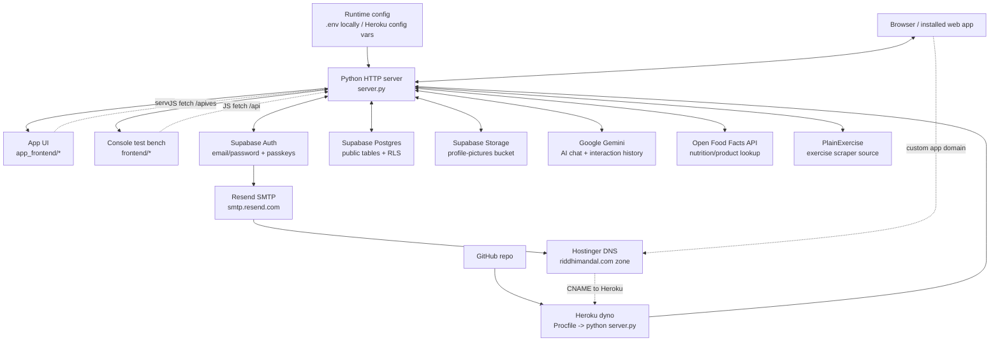
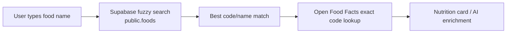

# Peak architecture map

This file is meant for a new engineer who needs to understand the moving parts quickly, especially when swapping providers such as Supabase, Resend, Heroku, Gemini, or Open Food Facts.

## Runtime diagram



## Repo ownership by layer

| Layer | Purpose | Main repo files |
|---|---|---|
| HTTP router/runtime | Serves app pages, test pages, API endpoints, refresh jobs, auth cookies, profile picture upload, schema endpoints | `server.py`, `Procfile`, `requirements.txt` |
| Real app frontend | Login/signup, dashboard, onboarding, profile, bottom navigation, dummy section pages | `app_frontend/*.html`, `app_frontend/assets/*` |
| Console/test frontend | Manual test pages for refresh, search, auth, AI, food lookup, schema links | `frontend/*.html`, `frontend/*.js` |
| Supabase client wrapper | Central place for Supabase credentials and table operations | `backend/db.py` |
| Auth/profile logic | Signup/login/logout/session refresh, username/email login, editable profile/onboarding validation | `backend/auth.py`, `backend/profile.py`, `server.py`, `app_frontend/assets/auth.js`, `app_frontend/assets/profile.js`, `app_frontend/assets/onboarding.js` |
| Database schema | SQL shown at schema endpoints and migration source files | `backend/schema.py`, `backend/full_schema.py`, `supabase/migrations/*.sql`, `database.dbml` |
| Exercise refresh/search | Scrapes PlainExercise, normalizes exercise records, writes `public.exercises`, generic fuzzy search | `backend/sync_exercises.py`, `backend/search.py`, `server.py`, `frontend/refresh.html`, `frontend/search-page.html`, `frontend/exercises.html` |
| Food name index + nutrition lookup | Stores lightweight `public.foods(code, name)` in Supabase, fuzzy-searches names locally, fetches full product details from Open Food Facts only after code/name match | `backend/sync_foods.py`, `backend/food_search.py`, `server.py`, `frontend/refresh-food.html`, `frontend/food-search-page.html`, `frontend/food-code-lookup.html` |
| AI/Pace chat | Sends structured prompts to Gemini, stores only session metadata in Supabase, fetches exercise/food detail cards after model response | `backend/ai_chat.py`, `backend/ai_service.py`, `backend/ai-test.py`, `frontend/ai-chat-test.html`, `frontend/ai-chat-test.js` |
| Body/exercise metric seed data | Loads body metrics from `metrics.xlsx`, loads exercise equipment metric matrix | `backend/sync_metrics.py`, `backend/sync_exercise_metrics.py`, `metrics.xlsx`, `calculate_volume.py` |
| Tests | Protects core behavior while editing routes/frontend/backend | `tests/*` |

## External services and what to change

| Component | Current role | If replacing or changing it, update |
|---|---|---|
| Supabase Auth | Email/password signup/login, passkeys, refresh sessions, `auth.users` | Supabase dashboard Auth settings; `backend/auth.py`; `backend/db.py`; `server.py` auth routes; `app_frontend/assets/auth.js`; `frontend/auth-test.*`; tests in `tests/test_auth.py` and `tests/test_app_frontend.py` |
| Supabase Postgres | Main app database: users, exercises, foods, metrics, workouts, meals, friends, leagues, AI session metadata | `backend/db.py`; `backend/schema.py`; `backend/full_schema.py`; `supabase/migrations/*.sql`; `database.dbml`; all backend modules that call `get_supabase_client()` |
| Supabase Storage | Public profile picture storage in `profile-pictures` bucket | Supabase Storage bucket/policies; `server.py` constants `PROFILE_PICTURE_BUCKET`; `backend/schema.py` bucket SQL; `app_frontend/assets/profile.js`; `tests/test_app_frontend.py` |
| Resend | SMTP provider used by Supabase Auth confirmation emails | Supabase dashboard only: Authentication -> Notifications -> SMTP Settings. DNS records live in Hostinger. No Resend SDK is currently used in this repo. |
| Hostinger DNS | DNS zone for `riddhimandal.com`, including app subdomains and `mail.riddhimandal.com` Resend verification records | Hostinger dashboard DNS records. Repo impact is documentation/env examples only unless hard-coded production hostnames are added later. |
| Heroku | Production Python app host | Heroku app settings, domains, config vars; `Procfile`; `server.py` host/port behavior; `requirements.txt`; Hostinger CNAME target |
| GitHub | Source repository and likely Heroku deploy source | Git remote/repo settings, branch protection/CI if added. Runtime code does not depend on GitHub after deployment. |
| Gemini | AI model and Interactions API history | `.env`/Heroku config vars `GEMINI_API_KEY`, `GEMINI_MODEL`, `GEMINI_INTERACTION_RETENTION_DAYS`; `backend/ai_chat.py`; `backend/ai_service.py`; `backend/ai-test.py`; `requirements.txt` |
| Open Food Facts | Full nutrition/product data by barcode/code | `.env`/Heroku config vars `OPENFOODFACTS_USER_AGENT`, `OPENFOODFACTS_PRODUCT_API_VERSION`; `backend/food_search.py`; `backend/ai_service.py`; food test pages |
| PlainExercise | Source for exercise list refresh | `backend/sync_exercises.py`; exercise schema if source fields change; `/refresh` and `/api/exercises/*` behavior in `server.py` |

## Current data boundary

The local Supabase `public.foods` table is intentionally small:

```text
public.foods
  code text primary key
  name text
```

It is a fuzzy-search index, not a full Open Food Facts mirror. The full nutrition record is fetched from Open Food Facts by `code` only when needed.

Do not add the full Open Food Facts parquet/database into Supabase unless the product direction changes. The app architecture currently assumes:



## App routes

The Python server owns both pages and APIs.

```text
/                         -> login/signup page
/app/dashboard            -> protected dashboard
/app/profile              -> protected profile page
/app/onboarding           -> protected onboarding flow
/app/workout              -> protected dummy workout page
/app/meals                -> protected dummy meals page
/app/charts               -> protected dummy charts page
/app/plan                 -> protected dummy plan/AI page
/app/friends              -> protected dummy friends page
/app/leagues              -> protected dummy leagues page
/logout                   -> clears local refresh cookie and redirects to login

/test                     -> console test bench
/refresh                  -> console exercise refresh progress page
/refresh-food             -> local food parquet/name upload endpoint/page
```

Important implementation files:

- Route resolution: `server.py`
- Real app shell/pages: `app_frontend/*`
- Test bench pages: `frontend/*`
- Shared app navigation: `app_frontend/assets/app-nav.js`

## API groups

| API group | Purpose | Main implementation |
|---|---|---|
| `/api/auth/*` | auth config, signup, login, passkey login/register support, session refresh, logout | `server.py`, `backend/auth.py` |
| `/api/profile`, `/api/profile-picture`, `/api/onboarding` | profile read/update, Supabase Storage profile picture upload, onboarding completion | `server.py`, `backend/profile.py` |
| `/api/supabase/schema` | full additive SQL for app database, excluding full Open Food Facts DB | `backend/full_schema.py`, `supabase/migrations/*` |
| `/api/users/schema`, `/api/exercises/schema`, `/api/foods/schema`, `/api/metrics/schema`, `/api/exercise-metrics/schema`, `/api/ai/schema` | smaller schema helpers | `backend/schema.py` |
| `/api/exercises/*` | exercise table read/sync/refresh status | `server.py`, `backend/sync_exercises.py` |
| `/api/food-names`, `/api/food-search`, `/api/food-product`, `/api/foods/refresh` | food fuzzy names, Open Food Facts search/product lookup, food name index refresh | `server.py`, `backend/food_search.py`, `backend/sync_foods.py` |
| `/api/search` | generic table-agnostic fuzzy search | `server.py`, `backend/search.py` |
| `/api/ai/*` | AI session list/detail/send message | `server.py`, `backend/ai_service.py`, `backend/ai_chat.py` |

## Production hostname checklist

When moving from local development to Heroku or another production host, check every item below.

| Area | Local value now | Production change |
|---|---|---|
| Heroku domain | none / local only | Add final host under Heroku Settings -> Domains |
| Hostinger DNS | root DNS zone for `riddhimandal.com` | Add CNAME for the app hostname pointing to Heroku's DNS target |
| Supabase Auth Site URL | usually `http://localhost:8000/...` while developing | Change to `https://<APP_HOST>/` or the final login route |
| Supabase Auth Redirect URLs | localhost routes | Add `https://<APP_HOST>/*` routes needed by auth confirmation/recovery |
| Supabase email templates | may contain localhost if manually edited | Remove hard-coded localhost; prefer Supabase variables like confirmation URL |
| Supabase Passkeys | RP ID `localhost`, origin `http://localhost:8000` | RP ID should be the final stable host or parent domain; origin must be exact `https://<APP_HOST>` |
| App env var `GYM_TRACKER_API_URL` | `http://127.0.0.1:8000/api` | `https://<APP_HOST>/api` if backend refresh scripts call the deployed API |
| App cookie security | `PEAK_COOKIE_SECURE=0` locally | Use `PEAK_COOKIE_SECURE=1` or rely on Heroku HTTPS forwarding; explicit `1` is cleaner |
| Open Food Facts user agent | placeholder contact | Set a real contact address before production |
| Resend sending domain | `mail.riddhimandal.com` | No app-host change needed if already verified |
| Resend webhooks | none currently | If added later, set webhook URL to `https://<APP_HOST>/<webhook-path>` |
| Supabase custom domain | default `*.supabase.co` | If enabled, update `SUPABASE_URL`, CSP in `frontend/auth-test.html`, and any environment/docs references |

## Provider swap map

### Swap Supabase for Firebase or another backend

This is the biggest change because Supabase currently owns auth, database, storage, RLS, and schema SQL.

Update or replace:

- `backend/db.py`
- `backend/auth.py`
- `backend/profile.py`
- `backend/search.py`
- `backend/food_search.py`
- `backend/sync_foods.py`
- `backend/sync_exercises.py`
- `backend/sync_metrics.py`
- `backend/sync_exercise_metrics.py`
- `backend/ai_service.py`
- `server.py` API handlers that call Supabase-backed modules
- `backend/schema.py`
- `backend/full_schema.py`
- `supabase/migrations/*.sql`
- `database.dbml`
- `app_frontend/assets/auth.js` if passkey/auth client behavior changes
- `frontend/auth-test.*`
- `requirements.txt`
- auth/profile/storage tests in `tests/*`

External settings to replace:

- Supabase Auth URL config
- Supabase passkey RP/origin config
- Supabase SMTP settings
- Supabase Storage bucket/policies
- Supabase RLS policies

### Swap Resend for another SMTP provider

Code impact is low because Supabase sends auth emails.

Update:

- Supabase dashboard: Authentication -> Notifications -> SMTP Settings
- Hostinger DNS records for the sending domain, if the new provider requires different SPF/DKIM/DMARC/CNAME/TXT records
- Documentation/env examples if sender address changes

Repo code generally does not change unless direct email sending is added later.

### Swap Gemini for another AI provider

Update:

- `backend/ai_chat.py`
- `backend/ai_service.py` if session/history semantics change
- `backend/ai-test.py`
- `requirements.txt`
- env vars in `.env.example` and Heroku config vars
- AI tests if response format or retention behavior changes

Important current assumption: Gemini Interactions API stores chat history for a limited retention window. Supabase stores AI session metadata, not the full message history.

### Swap Open Food Facts for another nutrition API

Update:

- `backend/food_search.py`
- `backend/ai_service.py` food enrichment fields
- food test pages in `frontend/*food*`
- nutrition card formatting in `frontend/ai-chat-test.js`
- env vars in `.env.example`

If the new provider does not use barcode/code identifiers, revisit `public.foods`, `meal_items.food_code`, and related DBML/schema references.

### Swap Heroku for another host

Update:

- Deployment config replacing `Procfile`
- Runtime env var setup
- Host/port binding expectations in `server.py`
- HTTPS/proxy behavior used for secure cookies
- Hostinger DNS app CNAME/A records
- Supabase URL/passkey/redirect settings for the new hostname

### Swap Hostinger DNS

Repo impact is mostly documentation. Move these DNS responsibilities to the new DNS provider:

- app hostname -> Heroku/new host
- `mail.riddhimandal.com` verification records for Resend or replacement SMTP provider
- root email records for Titan Mail if still used
- DMARC/SPF/DKIM records

### Replace the hand-written frontend with React/Vue/etc.

Update:

- `app_frontend/*`
- `server.py` static route resolution
- build/deploy configuration
- tests in `tests/test_app_frontend.py`

Keep `frontend/*` separate unless you intentionally want to replace the console test bench too.

## Environment variables

Set these locally in `.env`; set the same values in Heroku config vars for production.

| Variable | Used by | Notes |
|---|---|---|
| `SUPABASE_URL` | `backend/db.py` | Usually `https://<project-ref>.supabase.co` |
| `SUPABASE_SECRET_KEY` | `backend/db.py` | Server-only key. Never expose in browser code. |
| `SUPABASE_PUBLISHABLE_KEY` | `backend/db.py`, `backend/auth.py`, browser passkey config | Browser-safe public key. |
| `PEAK_COOKIE_SECURE` | `server.py` | `0` for local HTTP; `1` for production HTTPS. |
| `GYM_TRACKER_API_URL` | `backend/sync_exercises.py` | Optional; only needed when scripts call this app's HTTP API. |
| `PEAK_REFRESH_COOKIE_SECONDS` | `server.py` | Refresh cookie lifetime. |
| `ALLOW_REMOTE_FOOD_UPLOAD` | `server.py` | Keep `0` unless deliberately allowing remote parquet/name uploads. |
| `OPENFOODFACTS_PRODUCT_API_VERSION` | `backend/food_search.py` | Current exact product lookup version, usually `v3`. |
| `OPENFOODFACTS_USER_AGENT` | `backend/food_search.py` | Must identify the app and include a real contact before production. |
| `GEMINI_API_KEY` | `backend/ai_chat.py` | Server-side only. |
| `GEMINI_MODEL` | `backend/ai_chat.py` | Model name used for structured AI responses. |
| `GEMINI_INTERACTION_RETENTION_DAYS` | `backend/ai_service.py` | UI retention messaging and history expiry estimate. |

## Source of truth for schema

Use this order when editing database structure:

1. Update `database.dbml` so the model stays understandable.
2. Update SQL in `supabase/migrations/*.sql`.
3. Update `backend/full_schema.py` / `backend/schema.py` if the schema endpoint output changes.
4. Update backend code that reads/writes the affected tables.
5. Update frontend forms/cards that display those fields.
6. Update tests.

The full Open Food Facts database is not part of the Supabase schema. Only the lightweight `public.foods` code/name index belongs in Supabase.
